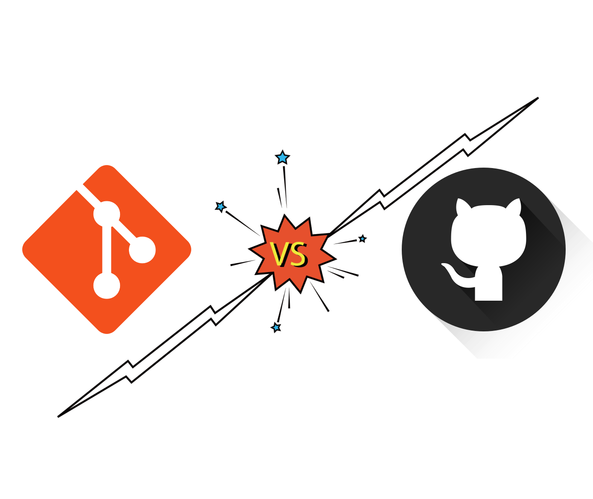
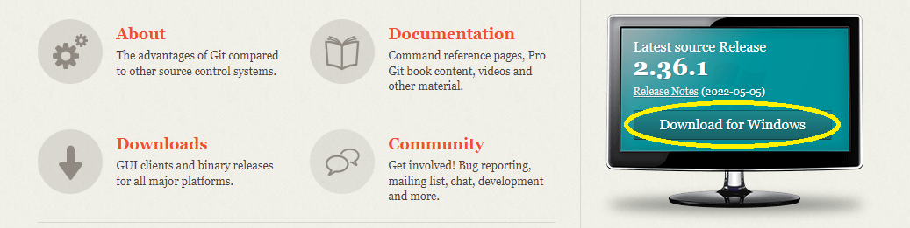
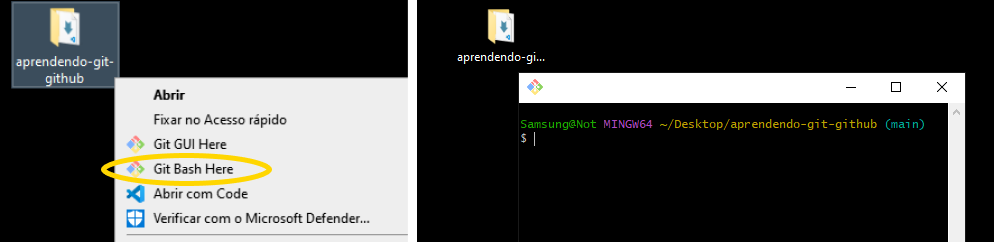
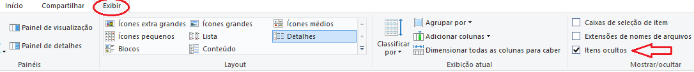
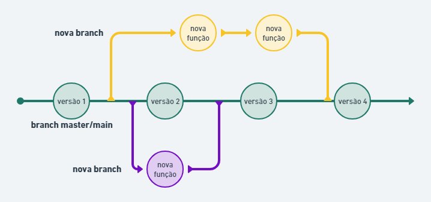
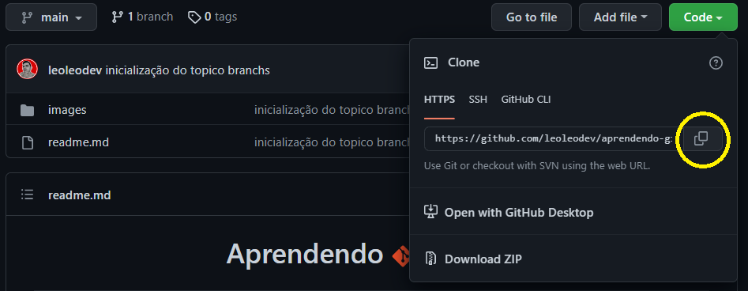
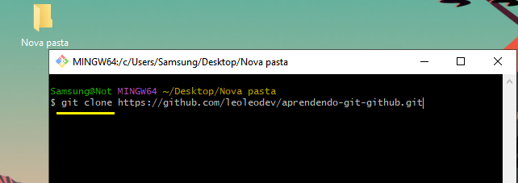

<h1 align="center"> Aprendendo
 e 
</h1>


<br>

    📌 Proposta

    A proposta deste guia é ajudar as pessoas que queiram aprender 
    a utilizar o git e o github como ferramenta de trabalho, organização 
    e aprendizado. Este guia pode ajudar você a conhecer a ferramenta 
    e até mesmo a tirar dúvidas caso já a utilize. 

---
## 🧭 Índice

- [Fundamentos e conceitos iniciais](#-Fundamentos-e-conceitos-iniciais)
- [Git e GitHub são a mesma coisa](#-Git-e-GitHub-são-a-mesma-coisa)
- [Instalação e configuração](#-Instalação-e-configuração)
- [Comandos iniciais](#-Comandos-iniciais)
- [O que são e como trabalhar com branchs](#-O-que-são-e-como-trabalhar-com-branchs)
- [git clone](#-git-clone)
- [git pull](#-git-pull)
- [Fork](#-fork)
- [pull requeste](#-pull-requeste)


---
## ⚙ Fundamentos e conceitos iniciais


- Vamos começar entendendo o problema

<p align="justify">
Lembremos da época de escola em que tinhamos que formar equipes e fazer um trabalho, cada um ficava responsável por uma parte, portanto você fazia sua parte e mandanva para "o colega", aquele mesmo, que ficava responsável por juntar tudo no final. Você termina sua parte e manda para ele, ele analisa a sua parte e lhe pede para alterar algo pois não está legal, você gera um novo arquivo com a alteração e manda, porém ele lhe retorna novamente pedindo outra alteração, você gera mais um arquivo e manda, desta vez "o colega" diz que a versão anterior estava melhor e pede para você manda-lá novamente, só que você não tem mais, pois apagou. 😟</p>
<p align="justify">
Então temos um problema, a pasta do trabalho está cheia de arquivos "trabalho final", "Agora vai", "ultimo", "trabalho dos infernos" e alguma das versões que "o colega" pediu você não tem mais, e agora? 😰</p>

- A solução é o git! 🤯
<p align="justify">
O git é uma ferramenta de versionamento de código gratuita e open source, com ela você pode organizar as versões do seu código sem ter que criar inúmeros arquivos para fazer alterações, ela permite que tenhamos controle de tudo aquilo que já escrevemos, apagamos e tudo que fizemos ou vamos fazer de alterações, de modo fantasioso podemos descrevê-la como uma máquina do tempo para códigos. 😁 </p>
<p align="justify">
Ainda sim podemos trabalhar com várias pessoas no mesmo projeto, sem que ocorram conflitos.
</p>

- Conceito de repositório
<p align="justify">
O git e o github trabalham com repositórios, diretórios, mas não precisa se assustar, no seu dia a dia você é acostumado a mexer com pastas, seja criando, movendo, apagando, o git chama essas pastas de repositórios.
</p>

---
## 📍 Git e GitHub são a mesma coisa
<h2 align="center">  </h2>


Não! O git e o github são coisas diferentes, porém trabalham juntos.

- Afinal qual a diferença?

<p align="justify">O git é uma ferramenta instalada localmente, ou seja, fica na sua máquina, tudo que você fizer ficará armazenado e somente você terá acesso, justamente por ser local.</p>

<p align="justify">Já github é uma plataforma onde podemos hospedar nossos códigos, lá temos acesso as versões criadas, alterações feitas e ainda funciona como uma rede social para programadores, muitos profissionais utilizam o github como portifólio para mostrarem seu projetos.

    💡 Em tempos mais antigos quando as empresas ofertavam vagas de emprego para
    desevolvedores, inseriam o git e o github como pré-requistos adicionais
    ou diferencial, atualmente as empresas já inserem git e github como
    requisito para a vaga.
</p>

## 🌐 Instalação e configuração

- Para instalar o git é muito simples, basta acessar o site oficial [clique aqui](https://git-scm.com/) e baixar a versão mais atual do git.
<h2 align="center">  </h2>
<p align="justify">A instalação é padrão, basicamente você só precisa ir clicando em next, next até chegar ao fim!</p>

Neste link o git será baixado para o sistema operacional windows, porém você pode obter o git também para linux ou macOS
[Saiba mais](https://git-scm.com/book/pt-br/v2/Come%C3%A7ando-Instalando-o-Git)

- Crie sua conta no github [clique aqui](https://github.com/) 

<h2 align="center">  </h2>

<p align="justify">A criação da conta no github é muito simples, basta ir fornencendo as informações que lhe forem pedidas e lembre-se do email que inserir lá, utilizaremos este mesmo email em configurações do git.</p>

- Git Bash

<p align="justify">O git fornece um terminal exclusivo chamado de git bash, ele é um terminal normal que já é instalado junto com o git e podemos executar todos os comandos de um terminal normalmente, a diferença é que o bash é personalizado para mexermos com git, mas fique a vontade para utilizar o seu terminal preferido. Para abrirmos basta clicar com o botão direito na pasta escolhida, clicar em git Bash e pronto ele abrirá dentro daquele repositório (pasta).</p>

<h2 align="center">  </h2>

Com o git bash aberto você pode inserir o comando:

```bash
$ git --version
```
Este coamando mostra a versão do git instalada atualmente e se mostrar a versão significa que está tudo certo e podemos começar a trabalhar.

Agora vamos nos indentificar para o git com os comandos:

```bash
$ git config --global user.name "seu nome"
```
```bash
$ git config --global user.email "seu email"
```
Utilize o mesmo email que inseriu para criar sua conta no github.

Caso precise ou queira visulalizar os seus dados insira o comando:

```bash
$ git config --list
```
🎉 Agora sim estamos prontos para começar!

---
## 📝 Comandos iniciais

- Versionando nosso primeiro arquivo


<p align="justify">Tenha em mente que começaremos trabalhando com o git (local). Crie uma pasta em sua máquina e dentro dela crie um arquivo.txt e nomeie de lista.txt, entre dentro deste arquivo e escreva o nome de alguns filmes por exemplo.</p>

<p align="justify">Agora temos que informar para o git que queremos versionar aquele diretório, então abra o git bash dentro desta pasta e insira o commando: </p>

- git init
    ```bash
    $ git init
    ```

    <p align="justify">Este comando inicia o git, informa para ele que queremos vercionar os arquivos que alí estão, você vai notar a criação de uma pasta oculta dentro da pasta isso significa que o git foi iniciado com sucesso e não apague estes arquivos pois é alí que o git faz todos os processos necessários, voce pode entrar e ver porém não mexa em nada.</p>

    <h2 align="center">  </h2>

        💡 Caso não esteja aparecendo clique em exibir e marque a opção itens ocultos

    <h2 align="center">  </h2>
    
<br>

- Adicionando os arquivos na área de stage:

<p align="justify">Agora que inciamos nosso git dentro da pasta precisamos informar quais arquivos serão rastreados pelo git, chamamos essa parte de stage pois é como se fosse os artistas de um show minutos antes de entrarem no palco, eles ficam esperando atrás da cortina para se apresentarem. Para colcarmos nossos arquivos na área de stage daremos o seguinte comando no git bash. Lembre sempre de estar dentro da pasta correta dentro do git bash!</p>

- git add
    ```bash
    $ git add "nome_do_arquivo.extensão"
    ```

    Após digitar o comando "git add" você terá que espeficar o nome do arquivo e sua extensão, no nosso exemplo seria assim: $ git add "lista.txt"
    
    <p align="justify">Mas vamos pensar, se nós tivessemos vários arquivos no projeto, temos que escrever o comando para todos os arquivos? Não! podemos inserir todos de uma só vez com uma pequena variação deste comando, assim:</p>
   ```bash
    $ git add .
    ```
    Agora pronto, todos os arquivos serão adicionados de uma vez.

<br>

<p align="justify">Agora sim nossos arquivos estão prontos para "apresentarem-se no show", quero dizer serem versionados, por tanto agora criaremos a primeira versão do nosso arquivo com o comando:</p>

- git commit
    ```bash
    $ git commit -m "nome do commit"
    ```
    <p align="justify">Dado este comando temos uma versão do nosso arquivo, o "-m" que vemos significa somente a mensagem que identifica o que fizemos de alterações, você pode colocar qualquer mensagem, porém sugiro colocar mensagenm que faça um sentido cronológico pois caso precise voltar em alguma versão elas estarão bem organizadas.</p>

<br>
Beleza temos nossa versão do arquivo e o próximo passo é mandar este lindo arquivo para o github.

<p align="justify">Entre em sua conta github e clique no canto superior direito em sua foto -> Your profile -> Repositóries, aqui é onde ficam seus projetos e todos podem entrar em seu perfil e visualizá-los, porém temos que criar um repositório.</p>

<p align="justify">Existe um botão do lado esquerdo destacado chamado "New" clique nele e informe o nome do repositório, é interessante que seja o mesmo nome da pasta onde estão os arquivos do seu projeto, após isso é só descer até o fim da página e clique em create repository e vualá, temos nosso repositório criado e agora temos que ligar este repositório do github com nosso projeto que está em nossa máquina, como fazemos isso? veja o próximo comando:</p>

- git remote add origin
    ```bash
    $ git remote add origin link_do_repositório
    ```

    <p align="justify">Com este comando fazemos uma ponte entre nosso arquivo local e nosso repositório no github. desta forma esta ponte só precisa ser feita uma vez pois a partir de então ela permanecerá, portanto só precisamos escrever este comando uma vez para aquele repositório.</p>

E agora chegou a tão esperada hora, vamos push "empurrar" nosso projeto para o github com o comando:

- git push -u origin
    ```bash
    $ git push -u origin nome_da_branch
    ```
    Este comando pode parecer feio porém você o fará muito e temos que firmar algumas informações:
    
    1 - O "-u" que vemos só precisa ser colocado na primeira vez que inserimos este comando para aquele reposótório.
    
    2 - O "nome_da_branch" indica de onde vai partir a versão do projeto, você entenderá o que é branch na próxima sessão, o importante agora é você saber que você está na branch master, na qual o nome pode ser alterado, veremo isso também mais adiante, porém se você não a alterou, não fez nada, você está na branch master e  o comando será o seguinte:

     ```bash
    $ git push -u master
    ```

Agora você pode dar um refresh na página do seu github ou entrar novamente em sua conta e estará lá o seu repositório com o arquivo dentro.

---
## O que são e como trabalhar com branchs

Para entendermos o que são branchs vamos visualizar uma imagem que resume o que elas são, observe:

<h2 align="center">  </h2>

<p align="justify">Repare que existe a branch master/main, ela é o caminho principal, é a cornologia do nosso arquivo, cada círculo representa um commit que você fez, então chegamos nas branch.</p>

- Branch

<p align="justify">Uma branch é nada mais do que uuma ramificação que fazemos no nosso código para fazer alterações que não temos certeza se irá de fato entrar no projeto, pense assim, você quer colocar um novo botão na sua aplicação porém você só quer testar para ver se realmente fica legal, mas não quer fazer a inclusão de fato e se nao ficar legal você voltar para a versão anterior do código, utilize uma branch, nela você faz commits normalmente e quando sentir que está pronto e quiser incluir é só fazer a inclusão.</p>

- Comandos:

    ```bash
    $ git branch
    ```
    - Com este comando você visualiza quantas branchs existem em seu projeto, na branch que você se localiza no momento aparecerá uma asterisco.

    <br>
    
    ```bash
    $ git branch nome_da_branch
    ```
    - Aqui temos o comando para criar uma banch, você pode nomea-lá como achar melhor, porém é interessante que o você escreva algo sucinto.

    <br>
    
    ```bash
    $ git checkout -b "nome_da_branch
    ```
    - Este comando também cria uma branch igualmente o comando anterior porém a diferença é que no comando anterior você somente cria a branch e depois temque entrar nela, com este comando você não só cria como já entra nela, e como navegamos nas branchs? veja no próximo topico.

    <br>
    
    ```bash
    $ git checkout nome_da_branch
    ```
    - Com este comando podemos transitar entre as branchs, é interesante que você visualize quais as branchs existentes com o coamndo git branch,  após isso escreve o coamndo e preste atênção no nome da branch, pois só irá funcionar se você escrever o nome da branch extamente como ela é.

    <br>

    
    ```bash
    $ git merge nome_da_branch
    ```
    - Pronto, agora você já criou sua branch, fez as alterações e decidiu que essa alteração deve entrar no projeto oficial, portanto na branch master/main, agora você faz a integração dessa branch com o comando acima. Mas antes preste atenção em qual branch você está, caso não esteja na master/main vá para ela, somente então você faz o comando de integração e pronto sua branch foi integrada com sucesso.

---
## git clone

<p align="justify">O git clone é um comando bem simples e útil, pois literalmente podemos clonar um repositório do github de alguém para nossa máquina. Quer ver?</p>

Vá em um repositório de alguém, entre nele e clique no botão code, clique no botão para copiar o link.
<h2 align="center">  </h2>

<br>

Feito isso crie uma pasta ou vá a té o local que deseja salvar este repositório em sua máquina, abra o git bash e insira o comando:

<h2 align="center">  </h2>

<p align="justify">Curiosidade: o git bash não aceita "ctrl + v" para colar, utilize "shift + insert" no seu teclado, ele irá colar, ou então "ctrl + shift + v"</p>

E pronto, você agora tem o repositório em sua máquina já com o git inicializado.

---
## git pull

Ao longo do desenvolvimento do código serão feitas mudanças e para você obter sempre a última versão do projeto insira o comando:

```bash
$ git pull
```

Com este comando você está seguro de estar sempre trabalhando na versão mais atual de um projeto.

<<<<<<< HEAD
<p align="justify">Este comando também serve para o caso de você ter efetado o comando de clone de um repositório de alguém e quer "puxar" as novas alterações que esta pessoa por ventura tenha feito, faça um pull.</p>
=======
<p align="justify">Este comando também serve para o caso de você ter efetuado o clone de um repositório de alguém e quer "puxar" as novas alterações que esta pessoa por ventura tenha feito, faça um pull.</p>
>>>>>>> e2541ff5553157a5d7a42377ed8b7b585b1323eb

Caso não tenham novas alterações e a versão já seja a mais atual, o comando pull irá informar.

---
## Fork

<p align="justify">O fork é muito simples de se entender. Você já entendeu como funciona o git clone, que faz uma cópia do repositório para sua máquina, porém digamos que você queira fazer uma cópia deste repositório direto para seu github, como fazemos isso?</p>

Utilize o fork 😎

<h2 align="center">  </h2>
Entre no repositório desejado e procure no canto superior direito pelo botão fork e clique nele. Apartir daí o processo irá ser feito, uma cópia do repositório aparecerá em seus repositórios.

---
## pull requeste

O pull request é uma colaboração que podemos fazer nos projetos que fizemos fork. Vamos entender melhor.

<p align="justify">Você encontrou um projeto que achou interessante e teve uma ideia para melhorar o projeto, então você faz a alteração e envia um pull request, o porque disso?</p>

<p align="justify">Você fez uma cópia de um projeto que não é seu, você pode fazer alterações porém quem decide se essas alterações irão de fato serem incorporadas no projeto é seu autor, por tanto o pull request é uma contribuição que você faz para um projeto, o autor irá receber esse pull request e decidirá aceitar ou não, isso faz com que a comunidade seja ativa e existam colaborações entre os desenvolvedores da plataforma.</p>


<hr>

<h3 align="center">Algumas palavras</h3>

<p align="justify">Este foi um breve conteúdo sobre git e github, porém ainda existem muitos conceitos para se aprofundar e praticar, espero ter passado uma excelente primeira visão sobre o assunto e contruir com a passagem de conhecimento, me diverti o fazendo pois com ele pude consolidar ainda mais meus conhecimentos.</p>

Quem sabe eu ainda volte aqui para explanar mais alguns outros comandos e maneiras de se trabalhar com esta maravilhosa ferramenta. 🖐
